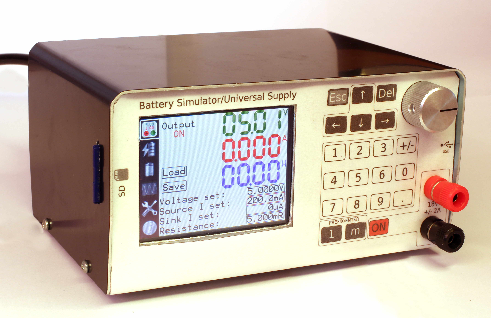
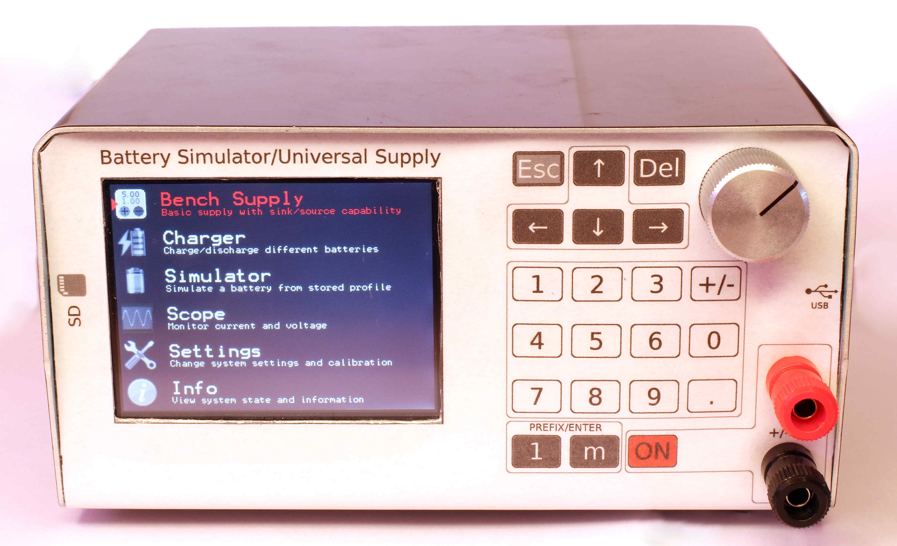

# battery-sim

## What is it?
The device emulates the behaviour of a battery, essentially it is a two quadrant supply with a configurable internal resistance.

Key features:
* Voltage range: 0 to 18V
* Current range: -3 to +3A
* Resistance range: 0.005 to 6Ohm

## Why was it built?
While developing other hardware meant to test batteries, various batteries in various different states (voltages, internal resistances, ...) were required to test some aspects. Normal batteries could have been used but getting them to (repeatedly!) behave in the necessary way would have been extremely time-consuming. So, this device was created.

It also doubles as a battery charger/discharger and general use supply.

